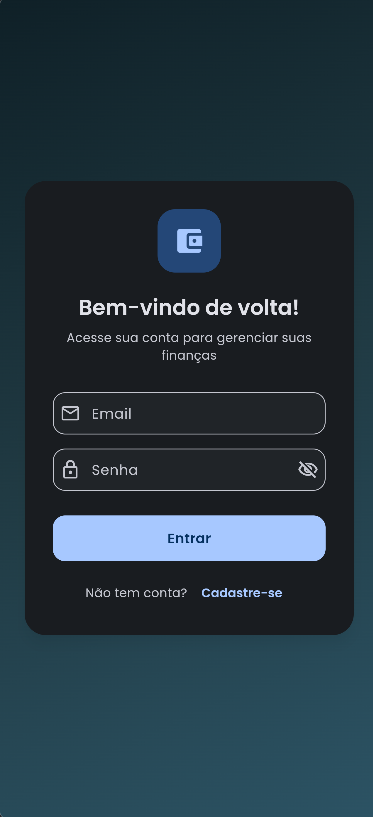
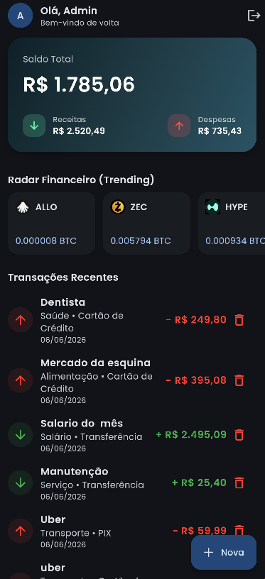
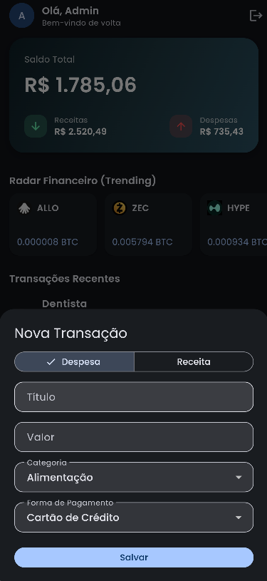
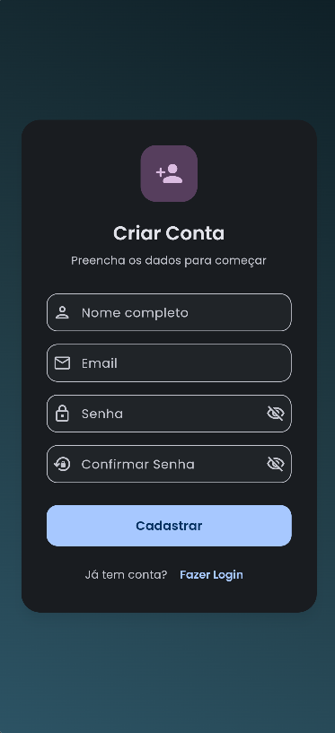

# 🚀 Controle Financeiro App 


Um aplicativo de gestão financeira premium, desenvolvido em **Flutter**, focado em performance, persistência offline-first e arquitetura limpa. Este projeto atende e excede todos os requisitos do **Projeto Avançado com Persistência e API**.

## 📱 Capturas de Tela

<div style="display: flex; flex-direction: row; gap: 10px;">
  
  
  
  
</div>

---

## 🏆 Requisitos da Entrega Atendidos

### 1. Gerenciamento de Estado Avançado
* **Tecnologia:** **Riverpod**
* **Implementação:** Toda a infraestrutura foi migrada para `StateNotifierProvider` e `ConsumerStatefulWidget`. O estado do app é gerenciado de forma puramente reativa, injetando dependências globalmente sem poluir a árvore de widgets.

### 2. Bancos de Dados (Híbrido / Offline-First)
* **Local (SQLite):** Banco de dados relacional embarcado utilizando suporte nativo e `sqflite_common_ffi_web`. Toda leitura de dados é ultra-rápida pois os dados ficam armazenados diretamente no dispositivo do usuário.
* **Nuvem (Firebase):** Integração com **Firebase Authentication** (login por e-mail e senha) e **Firestore** para sincronização da nuvem.

### 3. Consumo de API Externa (Tempo Real)
* **API:** [CoinGecko API v3](https://docs.coingecko.com/v3.0.1/reference/trending-search)
* **Feature:** **Radar Financeiro.** O aplicativo possui um módulo "Trending" no Dashboard que consome as Top 5 Criptomoedas em alta no mercado no momento, servindo como dicas e feed de investimentos.

### 4. UX e UI de Excelência (Premium)
* **Skeleton Screens (Shimmer):** Adicionado `shimmer_loading` durante a busca dos dados do mercado financeiro e histórico de transações, entregando uma percepção de velocidade incrível.
* **Dark Theme Dinâmico:** Paleta focada em "Slate/Teal" (tons escuros e verde neon) inspirada nos mais modernos apps bancários globais.
* **Tratamento de Erros:** Validações rigorosas em todos os formulários e tratamento de erros de conexão HTTP com a API.

### 5. Entrega do APK e Versionamento
* O código está em repositório no GitHub, totalmente testável na Web.
* **Pipeline CI/CD:** Configuramos uma **GitHub Action** em `.github/workflows` que compila automaticamente e gera a Release com o `.apk` pronto para instalação.
* O APK final para instalação pode ser baixado em [Releases](../../releases).

---

## 🏗️ Arquitetura de Software

O aplicativo utiliza a arquitetura **MVVM (Model-View-ViewModel)** orquestrada com Riverpod:
* **Models (`lib/data/models`):** Contratos estritos de dados (`UserModel`, `TransactionModel`), otimizados para `Map` JSON e comunicação entre Firebase e SQLite via UIDs (`String`).
* **Repositories (`lib/data/repositories`):** Abstrai as regras de acesso a banco de dados local (`DatabaseHelper`) e à nuvem.
* **Providers (`lib/providers`):** Regras de negócio e Injeção de Dependências (`AuthNotifier`, `TransactionNotifier`, `MarketNotifier`).
* **Views (`lib/views`):** UI pura interagindo apenas consumindo o estado injetado via `ref.watch()`.

---

## 🛠️ Como Executar

### Pré-requisitos
* Flutter SDK (`>=3.7.0`)
* Java JDK 17 (para gerar o APK do Android)

### Para rodar em ambiente de desenvolvimento
```bash
flutter pub get
flutter run
```

### Para gerar o executável (APK Final)
```bash
flutter build apk --release
```

### 🔐 Credenciais de Acesso para Teste (Avaliador)
* **E-mail:** `admin@gmail.com`
* **Senha:** `admin1`

### 🌐 Para rodar na Web via GitHub Codespaces
```bash
flutter run -d web-server --web-port 8080 --web-hostname 0.0.0.0
```
*O arquivo será gerado no diretório: `build/app/outputs/flutter-apk/app-release.apk`*
